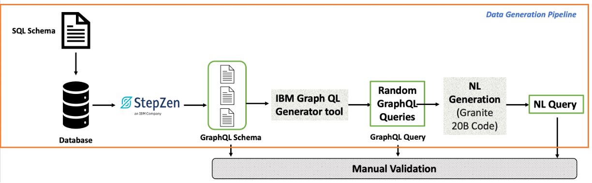

# NL2GQL


This repository contains a large, manually validated dataset designed for developing Natural Language interfaces for GraphQL query generation. It is fully compatible with the StepZen GraphQL Engine (https://stepzen.com/). Please note that this is an active repository, with ongoing updates and refinements as new data is added.

Root folder consists of Test and Training data sets. Each of which has several sub level folders.
Each sub-level folder indicates the data source; for instance, the WikiSQL folder comprises GraphQL queries over the WikiSQL Dataset. The WikiSQL dataset was released along with the following work Seq2SQL: Generating Structured Queries from Natural Language using Reinforcement Learning. We will call this dataset the WikiSQL GraphQL Dataset (https://github.com/salesforce/WikiSQL). 

# Details of WikiSQL GraphQL Dataset
Each folder in the WikiSQL GraphQL Dataset corresponds to one WikiSQL relation database table as indicated by the folder name. We have used StepZen to ingest the raw relational database and create the corresponding GraphQL Schema. Note that since the table names in the WikiSQL dataset had no semantic meaning, we generated the names using the IBM Granite 13B chat model. 

Next, we used an open-sourced library by IBM to generate random GraphQL query operations over the GraphQL schema. The details of the library is available at: https://github.com/IBM/graphql-query-generator
Finally, we used the IBM Granite 20B code model to generate the Natural language query corresponding to each GraphQL query operation. At the end, we manually validated the entire generated dataset, including the semantic table names, generated GraphQL query operation, and the corresponding NL query.

The below figure provides a brief overview of the data generation process.


# Details of CoSQL GraphQL Dataset
Each folder in the CoSQL GraphQL Dataset corresponds to one CoSQL relation database table as indicated by the folder name. We have used StepZen to ingest the raw relational database and create the corresponding GraphQL Schema. Next we used the StepZen interface to manually generate GraphQL queries and added the corresponding natural language queries manually. In this process we also manually edited the GraphQL schema to support some of the queries.

Finally, we used the IBM Granite 20B code model to generate 5-10 paraphrases of each natural language query corresponding to each GraphQL query operation. At the end, we manually validated the entire generated dataset, including the semantic table names, generated GraphQL query operation, and the corresponding NL query.  

Each folder in the WikiSQL/CoSQL GraphQL Dataset comprises of two files:
1. index.graphql : This file contains the StepZen created GraphQL Schema
2. nl_graphql_queries.jsonl : This file contains 10 Natural Language and the corresponding GraphQL query operation.  A line looks like the following:


```
{
    "Sno": 1,
    "Database": "Table_134987_3",
    "GT_GQL": "query RandomQuery {\n  AM_radio_stationsList {\n    format\n    frequency\n    target_city_market\n  }\n}\n",
    "NL": "Share the formats, frequencies and target_city_market."
}
```

At present we have curated 170 GraphQL schema and corresponding 1700 (GraphQL query operation, NL) pairs.

# Details of Test Dataset

Each folder in the Test Dataset comprises of two files:
1. index.graphql : This file contains the StepZen created GraphQL Schema
2. nl_graphql_queries.jsonl : This file contains Natural Language and the corresponding GraphQL query operation.  A line looks like the following:

```
{
    "Sno": 1,
    "Database": "Table_134987_3",
    "GT_GQL": "query RandomQuery {\n  AM_radio_stationsList {\n    format\n    frequency\n    target_city_market\n  }\n}\n",
    "NL": "Share the formats, frequencies and target_city_market."
}
```


# Licence
The data in this repository is available under the {\bf MIT License}.
